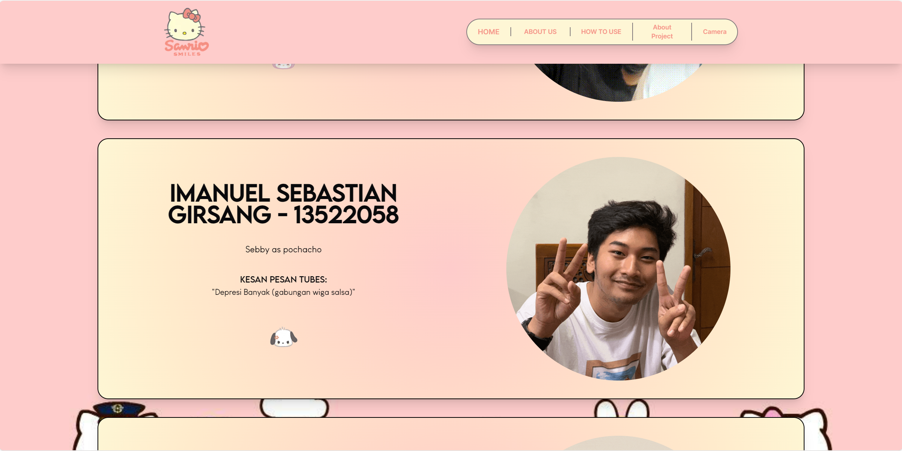
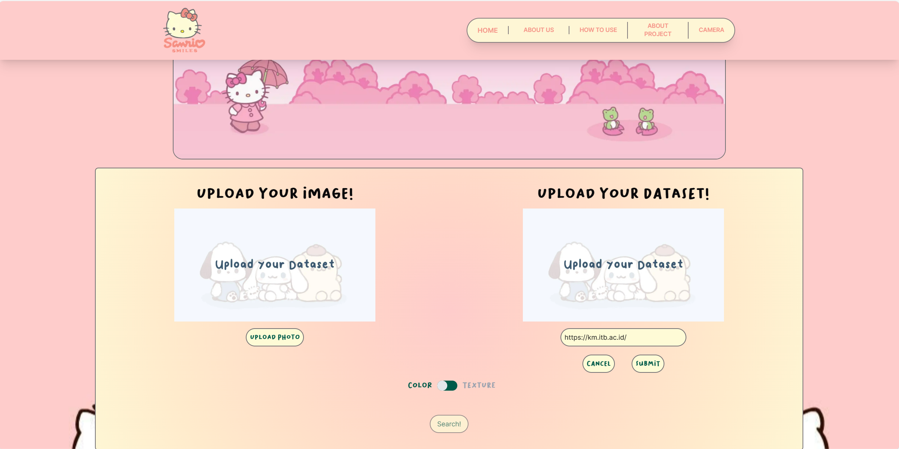
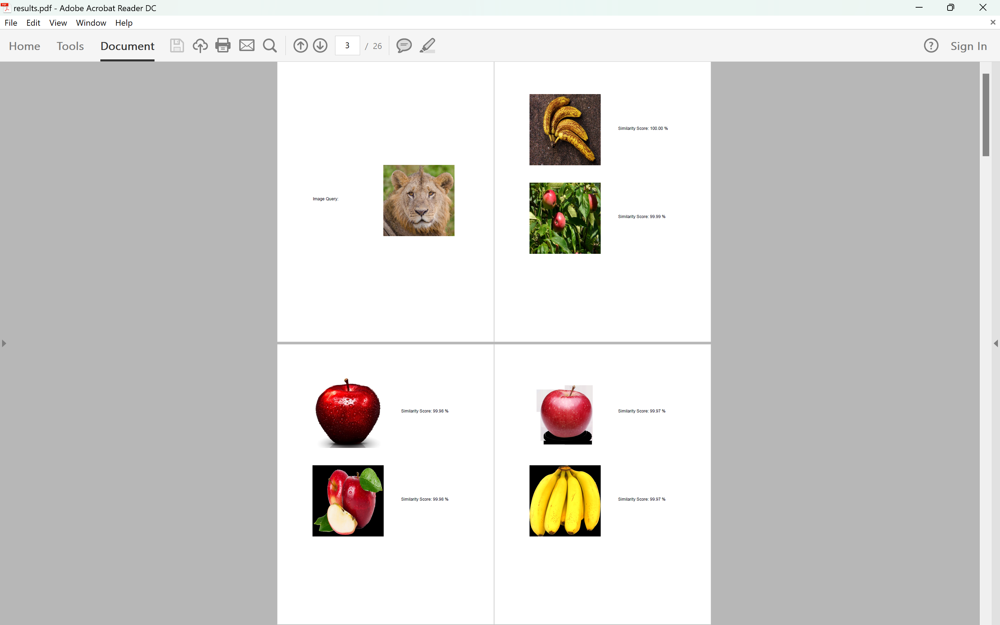

# Algeo02-22053
#### Tugas Besar 2 Aljabar Linier dan Geometri IF2123
#### Aplikasi Aljabar Vektor dalam Sistem Temu Balik Gambar

## Kelompok 44 'S43W79N'

| **NIM** | **Nama Anggota** |
|:---:|:---:|
| 13522053 | Erdianti Wiga Putri Andini |
| 13522058 | Imanuel Sebastian Girsang |
| 13522062 | Salsabiila |

## About The Program
Our program is designed for comparing an image and several images in a dataset with Content-Based Image Retrieval (CBIR) method. CBIR is a technique used to retrieve images from a database. In CBIR, users input a query image, and the system returns images from the database that are similar to the query image. To identify the most similar images, CBIR assesses the content of the query image in comparison to the images stored in the database. Our program employs two types of CBIR, color and texture. 

## How To Use The Program
1. Clone this repository.
2. Change directory to `src` by running `cd src`.
3. Run `python index.py` on your terminal.
4. Open a new terminal, then change directory to `src` by running `cd src` 
5. Run `npm run dev` on your terminal.
6. Follow the local link that appears in your terminal.
7. Upload your dataset folder by pressing the `Upload Your Dataset` button for getting dataset from local files or `Scrape Web` for getting dataset from a website.
8. Upload the image you want to look for its similarities by pressing the `Upload Your Image` button.
9. You can choose between `color or texture` method by pressing the `toggle button`.
10. Press the `Search` button for starting the comparison process.
11. Wait for a moment, the results with > 60% similarity will appear below the image. If there are no similar images, the message 'Tidak ada gambar yang mirip!' will appear.
12. To use `camera` feature, you can go to `Camera` page.
13. Upload your dataset first to activate the camera, then the comparison will running like as before.
14. You can save the results into a PDF file by pressing `Save Your Results?` button.

## Project Features
| **Features** | **Status** |
|:---:|:---:|
| CBIR with Color Method | Completed |
| CBIR with Texture Method | Completed |
| Capturing Image Using Webcam (Bonus) | Completed |
| Web Scraping (Bonus) | Completed |
| Video (Bonus) | Completed |
| Caching Result (Bonus) | Completed |
| Saving to PDF File (Bonus) | Completed |
| Extracting Other Features for Texture Such As Energy, Dissimilarity, and Correlation (Bonus) | Completed |

## Screenshots
1. Halaman Home Website
- Deskripsi Program

- Program Utama

2. Halaman About Us

3. Halaman How To Use

4. Halaman About Project

5. Program Utama
- Upload Dataset

- Upload Image

- Komparasi CBIR Warna dan Resultnya

- Penggantian Image

- Result Caching CBIR Warna dengan Dataset yang Sama
.jpg)
- Penggantian Dataset

- Komparasi CBIR Tekstur dan Resultnya

- Result Caching CBIR Tekstur dengan Dataset yang Sama
-1.png)
-2.png)

6. Fitur Kamera
- Halaman Kamera

- Upload Dataset

- Proses Komparasi

- Hasil Komparasi

7. Web Scraping
- Upload Dataset

- Result Komparasi CBIR Warna

- Result Komparasi CBIR Tekstur

8. Save to PDF
- Result CBIR Warna to PDF

- Result CBIR Tekstur to PDF

## Bonus Video
((link yt))